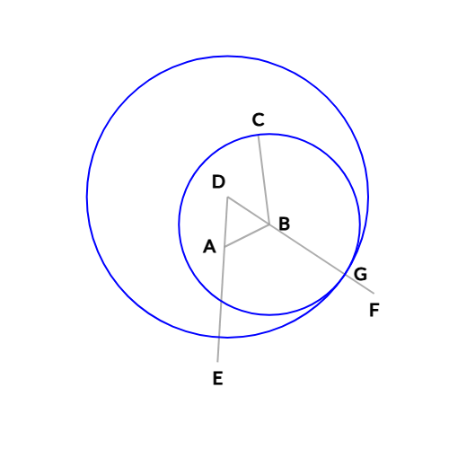
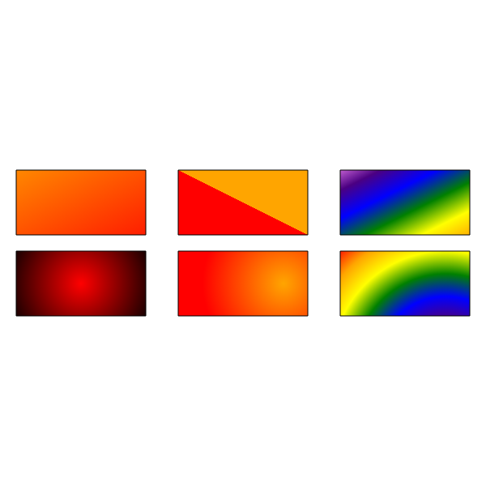
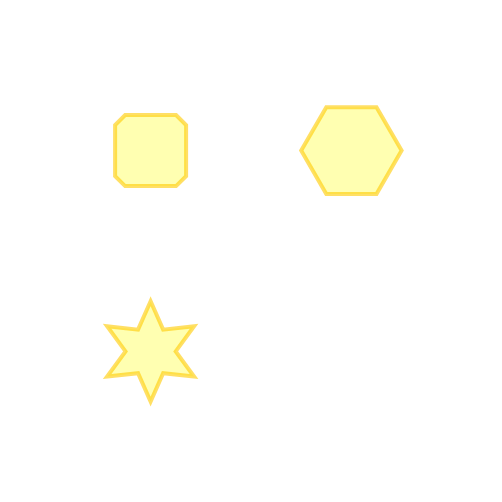
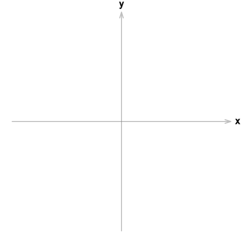

# Geometric Algebra 2D Graphics Monorepo

## Overview

A modern JavaScript (TypeScript) suite of ESM modules for rendering 2D graphics using Scalable Vector Graphics (SVG) in the browser.

[Live Demo of Block on a Ramp in STEMCstudio](https://www.stemcstudio.com/gists/38aa01dfe4eca3a22d3f972d17c17df2)

## Features and Benefits

* Cartesian (y increasing upwards), SVG (y increasing downwards), and other Coordinate Systems.
* Fine-Grained Reactivity for efficient updating.
* Dynamic diagram updating using reactive position, attitude, and scale properties to link shapes and text together.
* Geometric Algebra enabled multivectors for shape position and attitude properties providing coordinate-free and coordinate-based manipulation.
* Accurate (automatically generated) type definitions and API documentation.
* ESM, System, CommonJS, and UMD distribution formats.
* Modular package organization so that you only have to download what you need.

## Status

All packages are published together with the same version number.

 

## Tutorials and Examples

A book is in the works.

In the meantime, a search of `@g20` in the STEMCarXiv (STEMCstudio archive) at [STEMCstudio](https://www.stemcstudio.com) should produce many working examples.

## Packages and API Documentation

### [@g20/core](https://geometryzen.github.io/g2o-mono)

The core library that renders SVG. Required.

### [@g20/svg](https://geometryzen.github.io/g2o-mono/svg)

The SVG librray for creating SVG in the browser.

### [@g20/reactive](https://geometryzen.github.io/g2o-mono/reactive)

The shared reactive signals library. Required. You will only need to use this directly if you are creating your own shape extensions.

### [@g20/canvas](https://geometryzen.github.io/g2o-mono/canvas)

The HTML Canvas rendering library. Optional. Facilitates the generation of png images.

[Live Demo of CanvasView in STEMCstudio](https://www.stemcstudio.com/gists/beb5ee1690bf44e9429cbeeb7cd7d5a6)

Hint: Launch the Program from the toolbar then right-click the output to obtain an image.

### [@g20/euclid](https://geometryzen.github.io/g2o-mono/euclid)

Provides functions for computing circle and line intersections. Optional.

[Live Demo of Euclid's Elements Construction in STEMCstudio](https://www.stemcstudio.com/gists/28890bad7794270d959330e2eba82cc7)

### [@g20/gradient](https://geometryzen.github.io/g2o-mono/gradient)

Provides Linear and Radial Gradients. Optional. Gradients are instances of ColorProvider(s), which can be used for shape `fill` and `stroke` properties. You may extend g2o with custom ColorProvider(s).

[Live Demo of Linear and Radial Gradients in STEMCstudio](https://www.stemcstudio.com/gists/e82033ebe82bc5fd991a33a820cb7f83)

### [@g20/graphics](https://geometryzen.github.io/g2o-mono/graphics)

Provides RegularPolygon, RoundedRectangle, and Star shapes. Optional. Shapes such as these are extensions of the Path class. You may extend g2o with custom Path based classes.

[Live Demo of Graphics shapes in STEMCstudio](https://www.stemcstudio.com/gists/8f873d1ef37536795b40883aa2e77c01)

### [@g20/grid](https://geometryzen.github.io/g2o-mono/grid)

Provides a coordinate grid. Optional. The Grid class extends Group and provides an example of extending g2o with custom shapes based upon composition of existing shapes.

[Live Demo of Grid in STEMCstudio](https://www.stemcstudio.com/gists/7106f94b7639ce77bbcf2fcc88b217db)

### [@g20/player](https://geometryzen.github.io/g2o-mono/player)

Provides a Player for controlling animation frame start, and pause. Optional.

[Live Demo of Player in STEMCstudio](https://www.stemcstudio.com/gists/a88d400bc9176836bb4ff7f88340428a)

### [@g20/mock](https://geometryzen.github.io/g2o-mono/mock)
